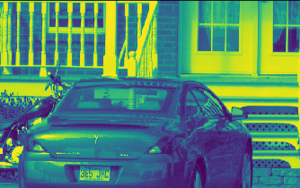
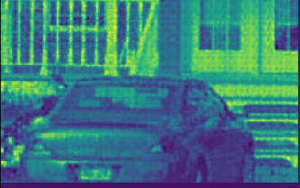

# ReconNet: Non-Iterative Reconstruction of Images from Compressively Sensed Measurements 

This repository is an implementation of the research paper ReconNet.

**ReconNet: Non-Iterative Reconstruction of Images from Compressively Sensed Measurements** 
\- Kuldeep Kulkarni, Suhas Lohit, Pavan Turaga, Ronan Kerviche, Amit Ashok 
[[arXiv](https://arxiv.org/pdf/1601.06892.pdf)][[Github](https://github.com/KuldeepKulkarni/ReconNet)]

## ReconNet

The paper introduces a non-iterative and an extremely fast image reconstruction algorithm from the compressively sensed random measurements. The authors proposed a CNN architecture which outputs intermediate reconstruction, which is further passsed through a denoiser to further improve the reconstruction. This algorithm is suitable when the task is to identify the major contents in the image. It tries to acquire very few measurements and still is able to reconstruct the image preserving the property of the scene. Moreover, it is computationally inexpensive due to it's non-iterative nature and can be introduced in resource-constrained environments. 
The following image is taken from the research paper.

  

## Compressive Sensing

It is a technique widely used in signal processing to sample a signal at sub-Nyguist rates. It takes the advantage of sparseness of the signal to reconstruct the original signal. The input signal is generally converted to DFT or DCT to make it sparse.  
A small number of random linear projections of original signal are measured (less than the signal size) and a reconstruction algorithm is used to recover the original signal. In this paper, the measurement matrix is constructed by generating a random Gaussian matric and then orthonormalizing its rows to find a set of orthogonal vectors. An improvement of ReconNet ([AdaptiveReconNet](https://link.springer.com/chapter/10.1007/978-981-10-7302-1_34)) allows learning of the measurements by the network itself. The idea is that adaptive measurement fits dataset better rather than random Gaussian measurement matrix, under the same measurement rate.

Following is the architecture of ReconNet taken from its paper.

  

Following is the structure of Adaptive ReconNet taken from the paper [Adaptive measurement network for CS image reconstruction.](https://link.springer.com/chapter/10.1007/978-981-10-7302-1_34)

  

## Requirements
* [python](https://www.python.org/downloads/) = 3.6
* [pytorch](https://pytorch.org/) = 1.0
* [opencv]() = 3.4.9
* [pandas](https://pandas.pydata.org/) = 0.22.0
* [numpy](https://www.numpy.org/) = 1.14.3
* [CUDA](https://developer.nvidia.com/cuda-zone) (recommended version >= 8.0)

## Sample Results

    
     

<pre>
                          Input Image                                        Reconstructed Image
</pre>

## Future Scope
The paper suggests use of off-the-shelf denoiser (BM3D) on the intermediate reconstruction to improve the image's quality. I have not implemented the denoising part, if you want to add the implementaion of BM3D to this repository, feel free to submit a pull request. :smiley:

## References
[ReconNet paper](https://arxiv.org/pdf/1601.06892.pdf) 
[ReconNet code (Caffe)](https://github.com/KuldeepKulkarni/ReconNet) 
[ReconNet code (TF)](https://github.com/kaushik333/Reconnet) 
[Adaptive ReconNet paper](https://arxiv.org/pdf/1710.01244.pdf) 
[Adaptive ReconNet code (TF)](https://github.com/yucicheung/AdaptiveReconNet) 
[Compressive Sensing](https://www.ece.iastate.edu/~namrata/EE527_Spring08/CompSens2.pdf)
